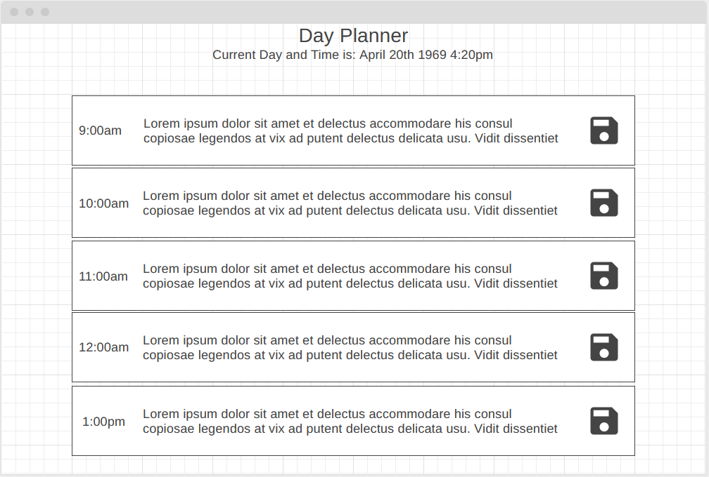
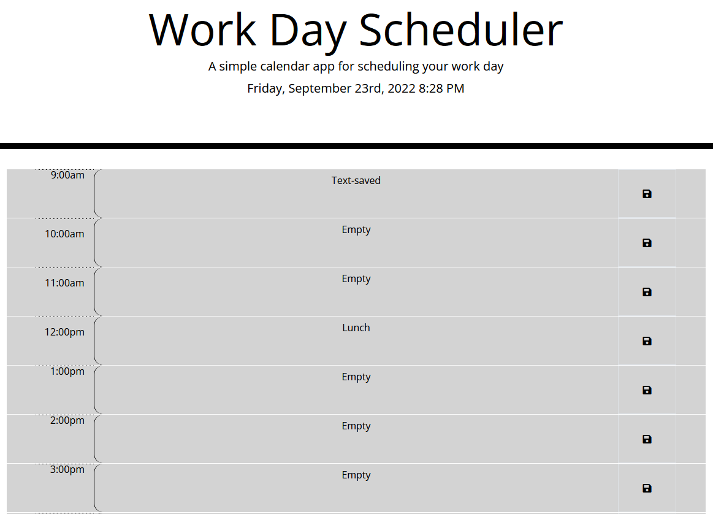

# Day_Planner

## Introduction
A simple program run to note day tasks during work hours.

## Table of Contents
1. [Motivation](#motivation)
2. [Images](#images)
3. [Installation](#installation)
4. [Credits](#credits)
5. [License](#license)

## Motivation
To practice the use of Bootstrap and Jquery and their applications.

## Images
- Wireframe plan

- Preview of site

## Installation
1. Run index.html file.
2. Select target time to update.
3. Edit text in text area.
4. Select the save button.
5. The input in the text area will be saved into local storage.

## Credits
Starting HTML, CSS, and JavaScript provided by Xandromus https://github.com/coding-boot-camp

## License
© 2022 Trilogy Education Services, LLC, a 2U, Inc. brand. Confidential and Proprietary. All Rights Reserved.
